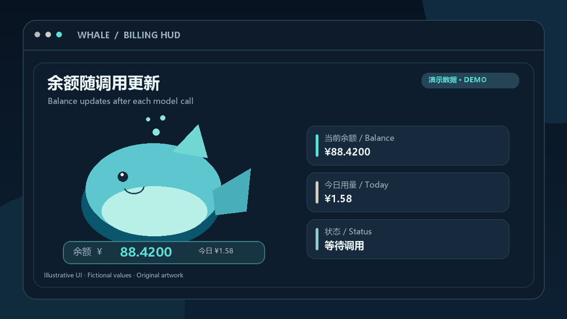
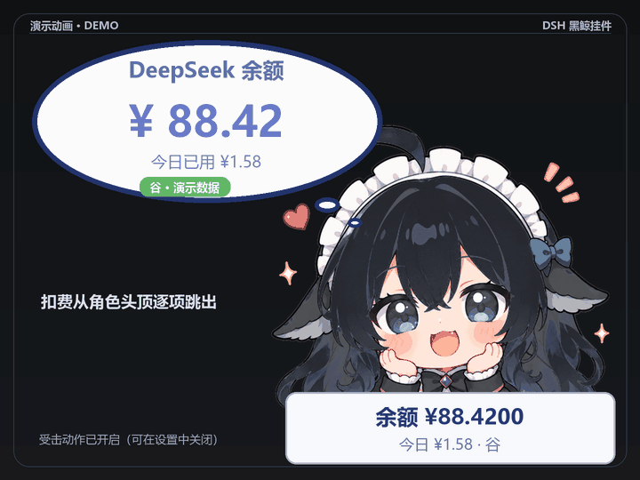

# DSH Whale Widget Billing HUD

[中文说明](README.md) · [Validation record](docs/VALIDATION.md) · [Implementation notes (Chinese)](NOTES.md) · [Third-party notices](THIRD_PARTY_NOTICES.md)

## Demo

The main image is an edited **screenshot of the actual widget**, supplied by the user, with fictional amounts. The two GIFs use the same locally customized black whale character to illustrate balance updates and sequential charge text beside the character. They are programmatically composed demonstrations, **not runtime recordings or proof of an end-to-end charge test**. The black-haired character is a locally recolored and cropped adaptation of `maid-atelier` art. The main image and GIFs follow **CC BY-NC-SA 4.0**, outside this repository's MIT code license. Attribution: 上善 → ZipZipPipe → Small-tailqwq; see the [modification notice](THIRD_PARTY_NOTICES.md).


| Balance update illustration | Charge breakdown illustration |
| --- | --- |
|  |  |

[Settings illustration](docs/media/settings.png) · [Media notes and regeneration](docs/media/README.md)

This package adds a balance display, per-call charge indicators, and movable bubble controls to the DSH desktop whale widget. It patches the widget plugin and, on the legacy `dsh-damage-pulse` 4.0.11 path only, the billing plugin. It does not redistribute the plugin packages. The edited demo screenshot and two GIFs contain CC BY-NC-SA 4.0 character artwork and are not MIT-licensed.

This is an independent community patch and is not affiliated with DSH or the maintainers of either dependency.

## What it is for

| Feature | Use |
| --- | --- |
| Persistent balance panel | Keep the account balance and today's usage visible below the character. Move, resize, or hide the panel. |
| Per-call charge indicators | Show each model call's charge near the character, including cache hit, cache miss, and output costs when the event provides a breakdown. |
| Optional hit reaction | Lightly animate the currently selected widget character on each charge. Toggle it in the ☰ settings menu; off by default. |
| Bubble controls | Adjust the bubble's text size, overall scale, and position. Save settings in browser storage and a local DSH configuration file. |
| Installer checks | Verify plugin versions and source anchors before modifying either plugin. Keep original-file backups for rollback. |

## Requirements and compatibility

- DSH desktop must have run at least once, creating a profile under `~/.dsh/profiles/`.
- Install `dsh-whale-widget` **0.3.12** and `dsh-damage-pulse` **4.2.3** in the same DSH profile for DSH `0.2.0-rc.2`. The legacy `4.0.11` billing path remains for DSH `0.1.7-rc.2`.
- Python 3.8 or newer. Node.js is optional but enables JavaScript syntax checks during installation.
- The legacy workflow was tested on Windows with DSH **0.1.7-rc.2**. On **0.2.0-rc.2**, billing plugin `4.0.11` is blocked; `4.2.3` loads and natively supports `deepseek-account` and charge events. One real model call produced a positively priced account-billing record; the brief floating animation was not captured, so visual end-to-end verification remains open. See the [validation record](docs/VALIDATION.md).

## Install

Run from the repository root:

```bash
python install.py --check
python install.py
```

If several profiles contain both plugins, choose one explicitly:

```bash
python install.py --check --plugin-root "/path/to/profile/node_modules"
python install.py --plugin-root "/path/to/profile/node_modules"
```

The installer checks both plugins before writing. It backs up and patches the widget. For billing plugin `4.0.11`, it also backs up and patches the billing files. For `4.2.3`, it verifies the packaged billing module and leaves that plugin untouched. Backup directories are ignored by Git. A failed preflight or patch returns a nonzero exit code.

**Fully restart DSH after installation.** Reloading the desktop window does not reload the injected front-end script.

## Verify

After restarting DSH:

1. Open the widget's `☰` menu and look for the balance panel, bubble controls, and the optional **Hit reaction** toggle (off by default).
2. Confirm the balance panel appears below the character and responds to drag and resize actions.
3. Make a model call and confirm that a charge indicator appears. This needs `dsh-damage-pulse` to be running and recording charge events.

For a developer check, run:

```bash
python -m unittest discover -s tests -v
python -m compileall -q install.py payload tests
node --check payload/balbox_patch.js
```

## Changes and rollback

The package patches the whale widget's host and front-end files. The legacy `4.0.11` path also patches the billing plugin's host and client files to support DSH account billing. Billing plugin `4.2.3` already provides that support and is not modified. The widget patch displays charge events and persists display settings. DSH itself is not modified.

To roll back, copy the saved original widget files from `payload/whale-widget-backup-0.3.12/` into the matching plugin paths, or reinstall the widget plugin through DSH. On the legacy `4.0.11` path, also restore `payload/damage-pulse-backup-4.0.11/` or reinstall that plugin. A widget upgrade overwrites its patch. The installer rejects unsupported plugin versions rather than applying old backups to new code.

## Repository contents

```text
install.py                    Installer and preflight
payload/patch_whale_widget.py Widget host and front-end patch
payload/patch_damage_pulse.py Billing host and client patch
payload/balbox_patch.js       Injected balance panel and menu code
tests/test_install.py         Installer behavior tests
tools/render_demo.py          Original geometric PNG renderer
tools/render_widget_gifs.py   Widget GIF renderer (needs a local licensed role PNG)
docs/media/                   Edited widget screenshot and illustrative media
docs/VALIDATION.md            Current runtime validation record
README.md                     Chinese guide
NOTES.md                      Chinese implementation notes
LICENSE                       MIT license for this project's original code
THIRD_PARTY_NOTICES.md        Dependency credits and licenses
```

The original code in this repository is released under the [MIT License](LICENSE). The event-driven hit reaction is inspired by `dsh-damage-pulse`; its animation and settings code are independently written. The extra blue-haired character and its assets are not included. See [third-party notices](THIRD_PARTY_NOTICES.md) for dependency credits and demo artwork licensing.
