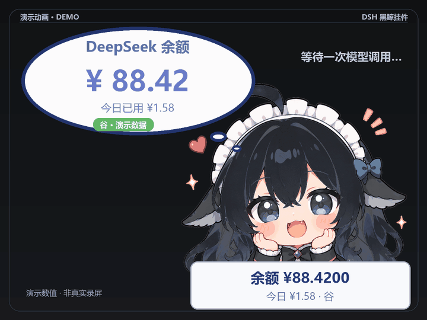

# DSH Whale Widget Billing HUD

Turn the DSH desktop whale widget into an at-a-glance usage display: **balance and today's usage below the character, itemized model charges above her head**. Move or resize the bubble and balance panel, and optionally enable a small reaction when a charge arrives.

[简体中文](README.md) · [Compatibility](#supported-versions-and-validation) · [Validation record](docs/VALIDATION.md) · [Implementation notes](NOTES.md) · [Artwork and licenses](THIRD_PARTY_NOTICES.md) · [Support](#support-the-project)

This is an **independent community patch** for [`dsh-whale-widget`](https://github.com/MeteorNOX/DeepSeek-Balance-Whale-Widget) and [`dsh-damage-pulse`](https://github.com/wssfk12138/dsh-damage-pulse), for people who want billing feedback on their existing character. It supplies an installer and additional widget code. It does not redistribute either plugin or the complete character image, and it does not modify DSH itself.

## Preview


| Balance update and overhead charge | Itemized charge indicators |
| --- | --- |
|  |  |

The main image is an edited user-supplied screenshot of the widget with fictional balance values. The GIFs are composed demonstrations that include blinking and the optional hit reaction; **they do not prove that the transient charge animation has been captured in a live session**. Character artwork follows CC BY-NC-SA 4.0; original code is MIT. [Media notes and regeneration](docs/media/README.md) · [Settings illustration](docs/media/settings.png)

## Features

| Feature | What it does |
| --- | --- |
| Persistent balance panel | Shows the balance to four decimal places and today's usage below the character; move, resize, or hide it. |
| Per-call charge indicators | Reads billing events and displays cache hit, cache miss, output, or fallback total costs above the character's head; refunds or credits appear in green. |
| Bubble and widget controls | Adjusts bubble text size, scale, and position; saves settings to `localStorage` and a local DSH configuration file. |
| Optional hit reaction | Lightly shakes the selected character when charged. The ☰ menu toggle is off by default. |
| Safe installation and rollback | Checks plugin versions and source anchors, backs up originals, and avoids stacking the patch on repeat runs. |

## Supported versions and validation

| DSH desktop | Widget plugin | Billing plugin | Installer behavior |
| --- | --- | --- | --- |
| `0.2.0-rc.2` | `dsh-whale-widget` `0.3.12` | `dsh-damage-pulse` `4.2.3` | Patches the widget; preflights the billing plugin and uses its native account billing and charge events. |
| `0.1.7-rc.2` | `dsh-whale-widget` `0.3.12` | `dsh-damage-pulse` `4.0.11` | Patches the widget and the legacy billing plugin. |

On Windows, installation, setting persistence, and one real positively priced billing record were verified. **The brief live charge text and hit movement were not captured**. The GIFs show the intended appearance only. See the [validation record](docs/VALIDATION.md). Unsupported plugin versions are rejected by preflight.

## Quick start

Install the matching plugin versions in the same DSH profile, then run from the repository root:

```bash
python install.py --check
python install.py
```

**Fully exit and reopen DSH afterward.** `Ctrl+R` does not reload front-end code injected at startup. If several profiles contain both plugins, select one with `--plugin-root "/path/to/profile/node_modules"`. Python 3.8+ is required; Node.js is optional for JavaScript syntax checks.

## Installation details

If several profiles contain both plugins, choose one explicitly:

```bash
python install.py --check --plugin-root "/path/to/profile/node_modules"
python install.py --plugin-root "/path/to/profile/node_modules"
```

The installer checks both plugins before writing. It backs up and patches the widget. For billing plugin `4.0.11`, it also backs up and patches the billing files. For `4.2.3`, it verifies the packaged billing module and leaves that plugin untouched. Backup directories are ignored by Git. A failed preflight or patch returns a nonzero exit code. Restart DSH as described in [Quick start](#quick-start).

## Verify

After restarting DSH:

1. Open the widget's `☰` menu and look for the balance panel, bubble controls, and the optional **Hit reaction** toggle (off by default).
2. Confirm the balance panel appears below the character and responds to drag and resize actions.
3. Make a model call and confirm that a charge indicator appears. This needs `dsh-damage-pulse` to be running and recording charge events.

For a developer check, run:

```bash
python -m unittest discover -s tests -v
python -m compileall -q install.py payload tests
node --check payload/balbox_patch.js
```

## Controls and settings

Drag the balance panel to move it. Drag its right edge to change width and its top edge to change thickness; double-click any of those areas to reset the corresponding value. Drag the bubble using the small grip centered on its top edge, or double-click the grip to reset its position.

| ☰ menu setting | Purpose |
| --- | --- |
| Show balance panel | Hide or show the panel below the character. |
| Balance font size | Set panel text from 8 to 24 px. |
| Bubble text size and scale | Adjust text and the overall bubble independently from 0.5× to 2×. |
| Bubble position and grip | Reset position or show and hide the drag grip. |
| Hit reaction | Lightly shake the selected character when charged; off by default. Charge text still appears when it is off. |

Settings are saved to both browser `localStorage` and `~/.dsh/.dshw-balbox.json`.

## Changes and rollback

The package patches the whale widget's host and front-end files. The legacy `4.0.11` path also patches the billing plugin's host and client files to support DSH account billing. Billing plugin `4.2.3` already provides that support and is not modified. The widget patch displays charge events and persists display settings. DSH itself is not modified.

To roll back, copy the saved original widget files from `payload/whale-widget-backup-0.3.12/` into the matching plugin paths, or reinstall the widget plugin through DSH. On the legacy `4.0.11` path, also restore `payload/damage-pulse-backup-4.0.11/` or reinstall that plugin. A widget upgrade overwrites its patch. The installer rejects unsupported plugin versions rather than applying old backups to new code.

## Known limits

- Charge text needs `dsh-damage-pulse` to be running and producing events.
- The patch supports only the plugin versions in the compatibility table. A plugin upgrade can replace the patched widget files.
- Runtime checks were performed on Windows. A transient live charge animation remains to be captured; demo GIFs are not runtime evidence.

## Repository contents

```text
install.py                    Installer and preflight
payload/patch_whale_widget.py Widget host and front-end patch
payload/patch_damage_pulse.py Billing host and client patch
payload/balbox_patch.js       Injected balance panel and menu code
tests/test_install.py         Installer behavior tests
tools/render_demo.py          Original geometric PNG renderer
tools/render_widget_gifs.py   Widget GIF renderer (needs a local licensed role PNG)
tools/assets/                 CC BY-NC-SA 4.0 partial blink overlay
docs/media/                   Edited widget screenshot and illustrative media
docs/VALIDATION.md            Current runtime validation record
README.md                     Chinese guide
NOTES.md                      Chinese implementation notes
LICENSE                       MIT license for this project's original code
THIRD_PARTY_NOTICES.md        Dependency credits and licenses
```

The original installer and patch code is released under the [MIT License](LICENSE). The edited screenshot, GIFs, and blink overlay contain adapted `maid-atelier` art under **CC BY-NC-SA 4.0**; the complete role image is not bundled. The hit reaction takes interaction inspiration from `dsh-damage-pulse`, but its code is original, and that plugin's extra blue-haired character is not included. The maintainer-supplied support image has its own usage boundary. See [third-party notices](THIRD_PARTY_NOTICES.md) for attribution and details.

## Support the project

This project is free to use. If it helps you keep track of desktop usage, you can star the repository or voluntarily support its maintainer, Lionwen. Support is never required to use any feature.

<a href="docs/media/support-lionwen.png"></a>

[Open the full-size support image](docs/media/support-lionwen.png)
